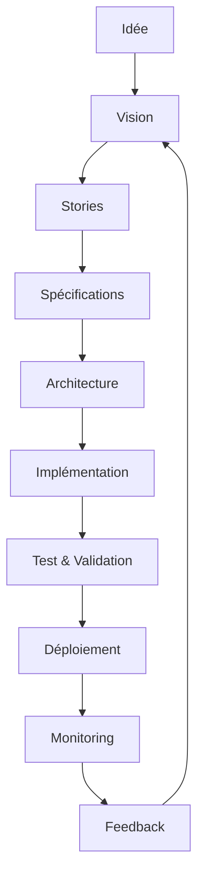

# Guide Ultime d'Utilisation du GraphWork Framework

## Introduction

Ce guide ultime vous accompagne pas à pas dans l'utilisation optimale du GraphWork Framework, de l'initialisation à la maîtrise avancée de toutes ses fonctionnalités.

## Chapitre 1 : Démarrage Ultime

### 1.1 Installation Maîtrisée

```bash
# Installation globale pour un accès système
npm install -g graphwork-cli

# Vérification de l'installation
gw --version
```

### 1.2 Initialisation Pro

```bash
# Initialisation avec toutes les options
gw init projet-ultime \
  --template fullstack \
  --tech react,nodejs,postgresql,redis \
  --domain saas \
  --features auth,cache,logging,monitoring

# Structure générée :
# projet-ultime/
# ├── work/
# ├── src/
# ├── tests/
# ├── docs/
# └── graphwork.config.js
```

### 1.3 Configuration Avancée

Créez un `graphwork.config.js` optimisé :

```javascript
module.exports = {
  ai: {
    provider: 'openai', // ou 'anthropic', 'gemini'
    model: 'gpt-4-turbo',
    temperature: 0.2, // Plus déterministe pour le code
    maxTokens: 4096,
    apiKey: process.env.OPENAI_API_KEY, // ou process.env.ANTHROPIC_API_KEY, process.env.GOOGLE_GEMINI_API_KEY
    retryAttempts: 3,
    timeout: 30000
  },
  
  security: {
    dataProtection: true,
    inputValidation: true,
    consentManagement: 'strict',
    vulnerabilityScanning: true,
    sensitiveDataDetection: true,
    encryption: 'AES-256-GCM'
  },
  
  quality: {
    codeStandards: 'strict',
    testCoverage: 90, // Objectif élevé
    securityAudit: true,
    performanceBenchmarks: true,
    maintainabilityIndex: 90,
    cyclomaticComplexity: 10
  },
  
  performance: {
    caching: true,
    cacheStrategy: 'LRU',
    cacheTTL: 1800, // 30 minutes
    rateLimiting: {
      requestsPerMinute: 1000,
      burstLimit: 2000
    },
    resourceLimits: {
      maxConcurrent: 50,
      maxMemory: '2GB',
      maxCPU: '80%'
    }
  },
  
  traceability: {
    decisionLogging: true,
    attributionTracking: true,
    auditTrail: true,
    explanationRequired: true
  },
  
  privacy: {
    dataAnonymization: true,
    consentRequired: true,
    gdprCompliance: true,
    piiDetection: true,
    dataRetention: '2 years'
  }
};
```

## Chapitre 2 : Maîtrise de la Structure de Projet

### 2.1 Organisation Work Ultime

```
work/
├── 01-vision/
│   ├── product_brief.md        # Vision du produit
│   ├── user_stories.md         # Stories utilisateur
│   ├── evil_stories.md         # Scénarios d'abus
│   └── executive_summary.md    # Résumé exécutif
├── 02-specs/
│   ├── functional_spec.md      # Spécifications fonctionnelles
│   ├── non_functional_spec.md  # Spécifications non-fonctionnelles
│   └── technical_spec.md       # Spécifications techniques
├── 03-architecture/
│   ├── system_architecture.md  # Architecture système
│   ├── component_design.md     # Design des composants
│   └── deployment_arch.md      # Architecture de déploiement
├── 04-delivery/
│   ├── roadmap.md              # Feuille de route
│   ├── tasks_backlog.md        # Backlog de tâches
│   └── sprint_plans.md         # Plans de sprint
├── 05-quality/
│   ├── coding_standards.md     # Standards de codage
│   ├── testing_strategy.md     # Stratégie de test
│   └── quality_checklist.md    # Checklist qualité
├── 06-data/
│   ├── data_model.md           # Modèle de données
│   ├── schemas/                # Schémas détaillés
│   └── migration_scripts/      # Scripts de migration
├── 07-compliance/
│   ├── security_policy.md      # Politique de sécurité
│   ├── privacy_policy.md       # Politique de confidentialité
│   └── audit_reports/          # Rapports d'audit
├── logs/
│   ├── decisions.md            # Journal des décisions
│   └── questions.md            # Questions ouvertes
├── prompts/
│   ├── code_generation.md      # Prompts de génération de code
│   └── review_prompts.md       # Prompts de revue
└── templates/
    ├── custom_templates/        # Templates personnalisés
    └── ai_prompts/             # Prompts spécifiques à l'IA
```

### 2.2 Documentation Automatique

Activez la génération automatique de documentation :

```bash
# Générer la documentation complète
gw docs:generate --format html,markdown,pdf

# Générer la documentation API
gw docs:api --output docs/api-reference
```

## Chapitre 3 : Génération de Code Ultime

### 3.1 Génération Assistée par IA Avancée

```bash
# Génération avec contexte riche
gw generate controller \
  --name UserController \
  --context work/03-architecture/api_design.md,work/02-specs/user_management.md \
  --style restful \
  --auth jwt \
  --validation yup \
  --tests jest

# Génération de composants frontend
gw generate component \
  --name UserDashboard \
  --context work/02-specs/ui_specs.md \
  --framework react \
  --styling tailwind \
  --state redux \
  --tests react-testing-library
```

### 3.2 Templates Personnalisés Ultime

Créez des templates hyper-spécialisés :

```
work/templates/custom/
├── microservice/
│   ├── docker-compose.yml.tpl
│   ├── k8s-deployment.yaml.tpl
│   ├── service-template.ts.tpl
│   └── integration-test.ts.tpl
├── event-driven/
│   ├── event-handler.ts.tpl
│   ├── event-bus.ts.tpl
│   └── event-schema.json.tpl
└── ml-pipeline/
    ├── data-pipeline.py.tpl
    ├── model-trainer.py.tpl
    └── inference-api.py.tpl
```

### 3.3 Génération Batch

```bash
# Générer plusieurs composants en batch
gw generate batch --config work/templates/batch-config.json

# Exemple de fichier batch-config.json
{
  "components": [
    {
      "type": "controller",
      "name": "UserController",
      "context": "work/02-specs/user_management.md"
    },
    {
      "type": "service",
      "name": "EmailService",
      "context": "work/02-specs/notification_system.md"
    },
    {
      "type": "model",
      "name": "User",
      "context": "work/06-data/user_schema.md"
    }
  ]
}
```

## Chapitre 4 : Validation Ultime

### 4.1 Validation Multi-Couches

```bash
# Validation complète du projet
gw validate --all --strict --report detailed

# Validation de la sécurité uniquement
gw validate --security --depth deep --output security-report.json

# Validation des performances
gw validate --performance --benchmark baseline.json
```

### 4.2 Tests Automatisés Ultime

```bash
# Exécuter tous les tests avec couverture maximale
gw test --coverage 95 --parallel --retry-flaky

# Tests de sécurité automatisés
gw test:security --scan-dependencies --vulnerability-check

# Tests de performance
gw test:perf --load-test --stress-test --memory-profile
```

### 4.3 Revue de Code IA

```bash
# Revue de code assistée par IA
gw review --files src/**/*.ts --style guide.md --security strict

# Comparaison de performance entre deux implémentations
gw review:perf --compare branch1,branch2 --metrics latency,memory,cpu
```

## Chapitre 5 : Analyse et Optimisation

### 5.1 Analyse d'Architecture Ultime

```bash
# Analyse complète de l'architecture
gw analyze --architecture --dependencies --complexity --patterns

# Visualisation des dépendances
gw analyze:deps --format graphviz --output deps-diagram.png

# Détection de code smells
gw analyze:smells --severity high,critical --auto-fix
```

### 5.2 Optimisation IA

```bash
# Optimisation des performances avec IA
gw optimize --target performance --strategy genetic

# Refactorisation intelligente
gw refactor --scope src/modules --goal maintainability

# Suggestions d'amélioration
gw suggest --context work/05-quality/coding_standards.md
```

## Chapitre 6 : Déploiement et CI/CD

### 6.1 Configuration CI/CD Ultime

```yaml
# .github/workflows/deploy.yml
name: Deploy Ultimate
on:
  push:
    branches: [main]
  pull_request:
    branches: [main]

jobs:
  build-and-deploy:
    runs-on: ubuntu-latest
    steps:
      - uses: actions/checkout@v3
      
      - name: Setup Node.js
        uses: actions/setup-node@v3
        with:
          node-version: '18'
          cache: 'npm'
      
      - name: Install dependencies
        run: npm ci
        
      - name: Build
        run: npm run build
        
      - name: Quality Check
        run: |
          gw validate --all --strict
          gw test --coverage 90
          
      - name: Security Scan
        run: gw validate --security --depth deep
        
      - name: Deploy
        run: |
          gw deploy --env production --strategy blue-green
          gw monitor --duration 30m --alert critical
```

### 6.2 Déploiement Intelligent

```bash
# Déploiement avec rollback automatique
gw deploy \
  --env production \
  --strategy canary \
  --traffic 10% \
  --monitor health,performance \
  --rollback-threshold errors>5%

# Déploiement blue-green
gw deploy \
  --env production \
  --strategy blue-green \
  --health-check http://localhost:3000/health \
  --warmup-duration 5m
```

## Chapitre 7 : Surveillance et Maintenance

### 7.1 Surveillance Ultime

```bash
# Configuration de la surveillance
gw monitor:setup \
  --metrics cpu,memory,disk,latency,requests \
  --alerts critical,error,warning \
  --integrations slack,pagerduty,email

# Surveillance en temps réel
gw monitor --live --dashboard --export grafana
```

### 7.2 Maintenance Prédictive

```bash
# Analyse de la dette technique
gw maintain:tech-debt --analyze --prioritize --plan

# Mise à jour des dépendances
gw maintain:deps \
  --update minor,patch \
  --security-audit \
  --test-impact

# Rotation des clés de sécurité
gw maintain:security --rotate-keys --notify-stakeholders
```

## Chapitre 8 : Collaboration et Gouvernance

### 8.1 Gestion des Connaissances

```bash
# Synchronisation de la base de connaissances
gw knowledge:sync --sources docs,wiki,meetings --format markdown

# Extraction des insights
gw knowledge:extract --from logs,decisions,prompts --output insights.md

# Génération de rapports d'apprentissage
gw knowledge:learn --feedback github,slack --improve docs,templates
```

### 8.2 Gouvernance IA

```bash
# Audit des décisions IA
gw governance:audit --decisions logs/decisions.md --explainability required

# Conformité réglementaire
gw governance:comply --regulations gdpr,sox,hipaa --evidence work/07-compliance/

# Éthique IA
gw governance:ethics --bias-detection --fairness-metrics --transparency report
```

## Chapitre 9 : Personnalisation Avancée

### 9.1 Extensions et Plugins

```bash
# Créer une extension
gw extension:create --name custom-validator --type middleware

# Installer une extension
gw extension:install graphwork-plugin-auth-advanced

# Publier une extension
gw extension:publish --scope @myorg --access public
```

### 9.2 Configuration Dynamique

```javascript
// config/dynamic-config.js
module.exports = {
  // Configuration basée sur l'environnement
  development: {
    ai: { temperature: 0.7 }, // Plus créatif
    logging: { level: 'debug' }
  },
  
  production: {
    ai: { temperature: 0.2 }, // Plus déterministe
    logging: { level: 'error' },
    performance: { caching: true, cacheTTL: 3600 }
  },
  
  // Configuration basée sur les profils utilisateur
  profiles: {
    beginner: {
      assistance: 'high',
      validation: 'strict',
      templates: 'guided'
    },
    
    expert: {
      assistance: 'minimal',
      validation: 'standard',
      templates: 'advanced'
    }
  }
};
```

## Chapitre 10 : Bonnes Pratiques Ultime

### 10.1 Cycle de Développement



### 10.2 Workflow Git Ultime

```bash
# Workflow de feature branch
git checkout -b feature/user-authentication
gw generate controller --name AuthController --context work/02-specs/auth.md
gw validate --security
git add .
git commit -m "feat(auth): Add authentication controller with JWT support"
git push origin feature/user-authentication

# Pull Request avec validation automatique
# Le PR déclenche :
# 1. gw validate --all
# 2. gw test --coverage 90
# 3. gw review --security
# 4. Merge si tout passe
```

### 10.3 Stratégie de Versioning

```bash
# Versioning sémantique avec automation
gw version:bump --type minor --auto-changelog --git-tag

# Release notes automatiques
gw release:notes --generate --include commits,issues --format markdown

# Publication multi-canal
gw release:publish --channels npm,github,docker --sign
```

## Conclusion

Ce guide ultime vous fournit tous les outils et connaissances nécessaires pour maîtriser pleinement le GraphWork Framework. En combinant l'intelligence artificielle avec les meilleures pratiques de développement, vous pouvez créer des applications robustes, sécurisées et évolutives.

### Prochaines Étapes

1. **Explorer les exemples** : Consultez les exemples dans `/examples/`
2. **Rejoindre la communauté** : Participez aux discussions sur GitHub
3. **Contribuer** : Partagez vos améliorations et extensions
4. **Restez à jour** : Suivez les releases et mises à jour

### Ressources Supplémentaires

- **Documentation API** : https://docs.graphwork-framework.com/api
- **Tutoriels vidéo** : https://youtube.com/graphwork-tutorials
- **Communauté Discord** : https://discord.gg/graphwork
- **Blog** : https://blog.graphwork-framework.com

---

*Ce guide est vivant et évolue avec le framework. Dernière mise à jour : décembre 2025*