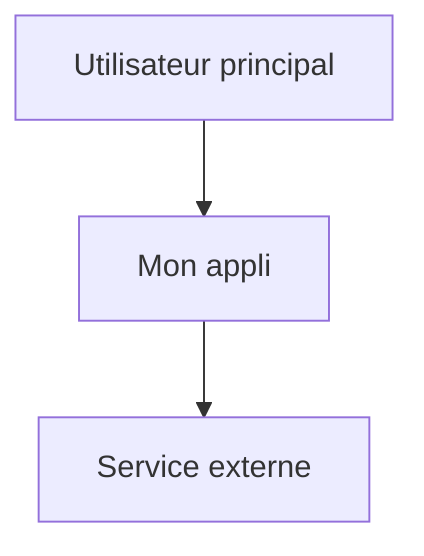

# 01 – Vision du projet

Ce dossier sert à décrire **ce que le projet veut faire** et **pour qui**.

## Fichiers recommandés

- `product_brief.md` : vision courte, objectifs, contraintes, hors périmètre.
- `user_stories.md` : user stories propres, avec critères d’acceptation.
- `evil_stories.md` : scénarios d’abus / risques majeurs.
- `executive_summary.md` (optionnel) : résumé exécutif très haut niveau.
- `uniqueness_proposition.md` (optionnel) : proposition de valeur unique.
- `glossary.md` (optionnel) : définitions des termes importants.
- `synthesis.md` (optionnel) : synthèse générale du projet.

## Diagrammes possibles ici

- Diagramme de contexte (C4 niveau 1) pour montrer :
  - les utilisateurs,
  - le système,
  - les systèmes externes.

Exemple (à adapter) :

