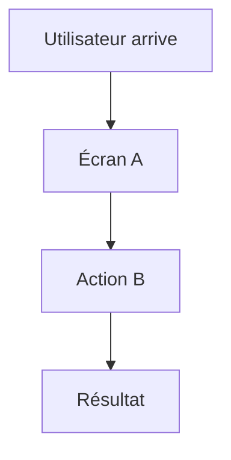

# 02 – Spécifications

Ici tu décris **comment le système doit se comporter**, sans encore parler du code.

## Fichiers recommandés

- `functional_spec.md` : regroupe les user stories en fonctionnalités.
- `non_functional_spec.md` : perf, sécurité, fiabilité, UX, etc.
- `technical_specification.md` (optionnel) : spécification technique détaillée.

## Diagrammes possibles

- Diagrammes de flux fonctionnels (user flow) pour les cas d’usage clés.

Exemple de flux utilisateur principal :

