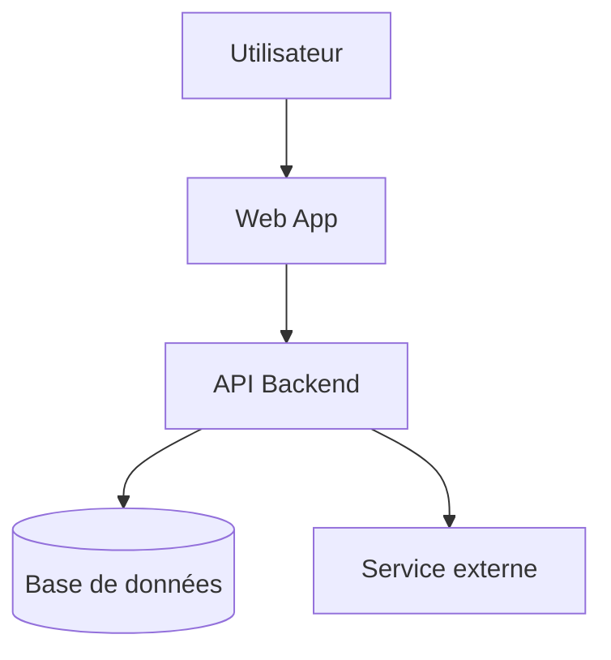
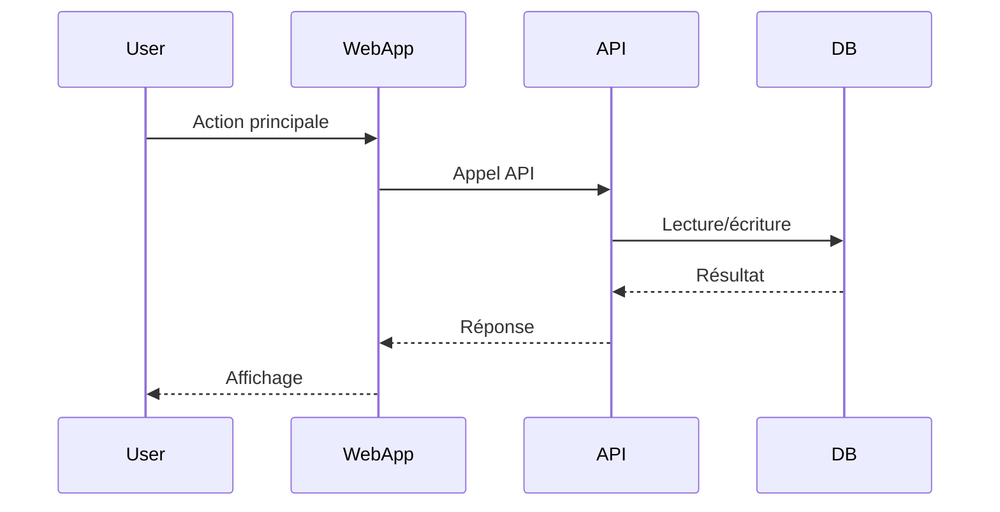

# 03 – Architecture

Ici tu décris **comment le système est structuré techniquement**.

## Fichiers recommandés

- `architecture_overview.md` : description haut niveau des couches/modules.
- `boundaries.md` : frontières entre front/back, API, services externes.
- `components.md` (optionnel) : composants internes importants.

## Diagrammes possibles

### 1. Architecture logique (type C4 – Container)

### 2. Séquence pour un cas d’usage clé

