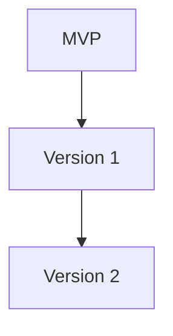

# 04 – Delivery (Roadmap & Backlog)

Ici tu organises **comment tu vas livrer le projet dans le temps**.

## Fichiers recommandés

- `roadmap.md` : phases (MVP, v1, v2…), objectifs de chaque phase.
- `tasks_backlog.md` : liste des tâches techniques détaillées.
- `project_plan.md` (optionnel) : plan de projet global.
- `gantt.md` (optionnel) : diagramme de Gantt ou planning détaillé.

## Diagrammes possibles

- Diagramme simple de dépendances entre features ou tâches :

- (Optionnel) Diagramme de planning / Gantt (si tu veux aller loin).
