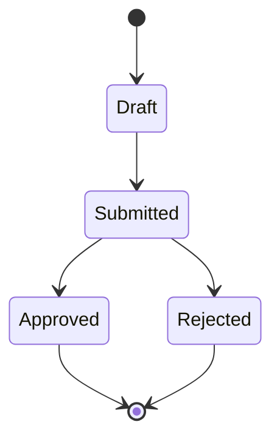

# 05 – Qualité (Clean code, tests, revues)

Ici tu définis **comment tu gardes un code propre et sûr**.

## Fichiers recommandés

- `coding_guidelines.md` : règles de clean code pour ce projet.
- `coding_standards.md` (optionnel) : standards de code plus formels.
- `testing_strategy.md` : quels types de tests, où et comment.
- `devsecops.md` (optionnel) : pratiques DevSecOps et sécurité dans le cycle de dev.
- `quality_checklist.md` : checklist avant de merger / livrer.

## Diagrammes possibles

- Diagramme d’états pour un workflow critique (ex : statut d’une commande) :

