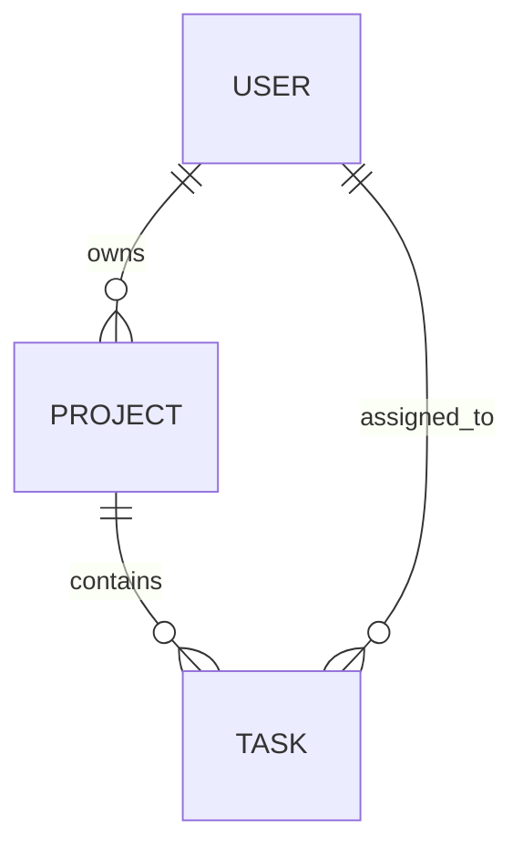

# 06 – Données (Tables & Relations)

Ici tu définis le **modèle de données** : tables, colonnes, relations.

## Fichiers recommandés

- `entities.md` : description des entités métier (User, Project, etc.).
- `tables.md` : liste des tables, colonnes, types, contraintes.
- `relations.md` : explication des relations (1-N, N-N, etc.).
- `migrations_plan.md` (optionnel) : plan de migration / évolutions du schéma.

## Diagrammes de base de données

Tu peux utiliser Mermaid pour faire un pseudo-ERD ou un graphe de tables.

Exemple simple (graphe de relations) :

Tu peux détailler les champs dans `tables.md` et garder `erDiagram` pour la vue globale.
